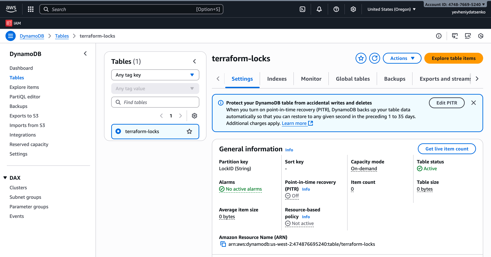
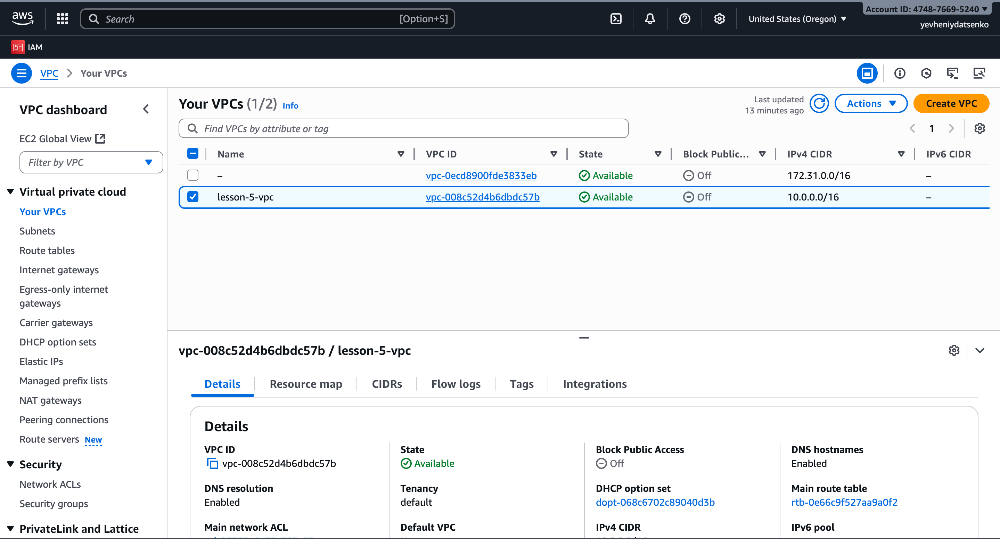
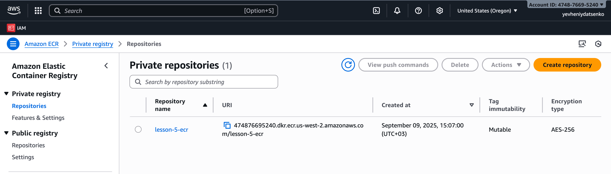

# Terraform Infrastructure as Code

This project implements basic AWS infrastructure using Terraform for a homework assignment on the topic of IaC. It includes the setup of a secure backend, network infrastructure, and container registry.

---

## Project Structure

```
├── main.tf                  # Module connections
├── backend.tf               # S3 backend configuration with DynamoDB for state locking
├── outputs.tf               # General resource outputs
├── assets                   # Screenshots and other static project files
│
├── modules/
│   ├── s3-backend/          # Module for S3 bucket and DynamoDB table
│   ├── vpc/                 # Module for VPC with public and private subnets
│   └── ecr/                 # Module for Elastic Container Registry
│
└── README.md                # This file
```

---

## Module Descriptions

- **s3-backend**: Creates an S3 bucket with versioning, encryption, and public access blocking enabled. A DynamoDB table ensures Terraform state locking to avoid conflicts during parallel work.
- **vpc**: Creates a private network infrastructure with a VPC, 3 public and 3 private subnets, an Internet Gateway, a NAT Gateway, and route tables.
- **ecr**: Creates an ECR repository for storing Docker images with image scanning and access policies enabled.

---

## How to Work with the Project

### Initialize the Project (after cloning or configuration changes)

```
terraform init
```

### Validate the Configuration

```
terraform validate
```

### Preview the Infrastructure Creation or Changes Plan

```
terraform plan
```

### Create or Update the Infrastructure

```
terraform apply
```

Terraform will prompt for confirmation; type `yes`.

---

## Destroy the Infrastructure

To avoid unnecessary costs, delete the created resources after completing your work:

```
terraform destroy
```

**Note:** During `destroy`, all resources will be deleted, including the S3 bucket and DynamoDB table that store the Terraform state. If these are deleted beforehand, it is not recommended to continue working with this project without reconfiguring the backend.

---

# Terraform Project Execution: Screenshots and Results





