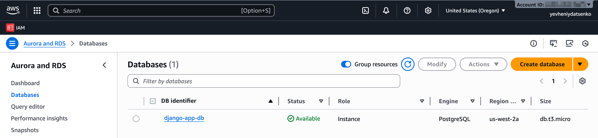
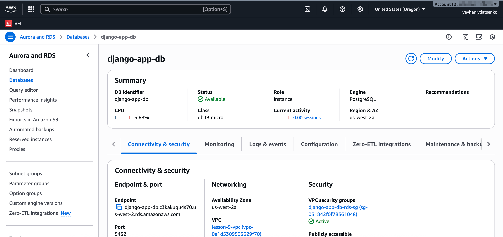
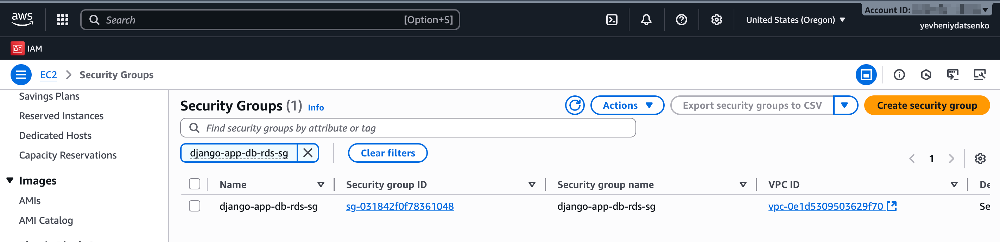
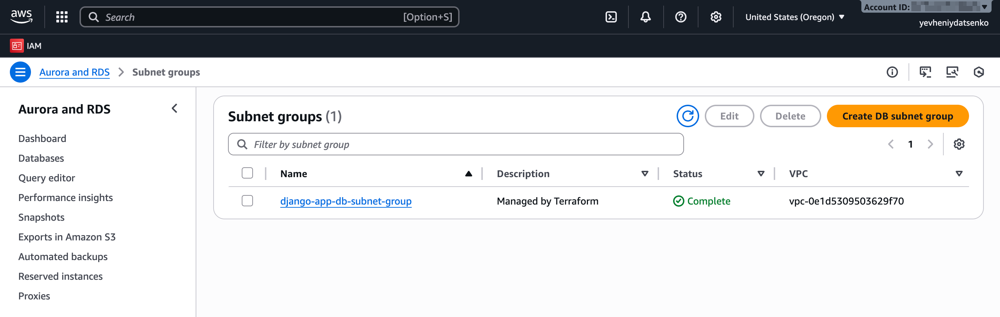

# Terraform RDS Module

## Overview

This project delivers a flexible Terraform module for provisioning AWS databases. It supports:

- Creating a standard RDS instance (PostgreSQL/MySQL)
- Creating an Aurora cluster with writer and readers

The choice is controlled by the `use_aurora` flag.

This module automatically creates the following AWS resources:

- DB Subnet Group
- Security Group
- Parameter Group configured with recommended settings

It is designed for reusability with minimal variable changes and supports production-ready deployment.

***

## How to Use the Module

1. Clone your repository and switch to branch `lesson-db-module`:

```bash
git clone <repository-url>
cd <project-folder>
git checkout lesson-db-module
```

2. Initialize Terraform and apply the configuration:

```bash
terraform init
terraform apply
```

Remember to destroy resources after use to avoid unexpected AWS charges:

```bash
terraform destroy
```

***

## Project Structure

```
Project/
├── main.tf                  # Main Terraform entrypoint
├── backend.tf               # Terraform backend config: S3 + DynamoDB
├── outputs.tf               # Outputs for all modules
├── modules/
│   ├── rds/                 # RDS Terraform module
│   │   ├── rds.tf           # Standard RDS instance resources
│   │   ├── aurora.tf        # Aurora cluster resources
│   │   ├── shared.tf        # Shared subnet group, security group, parameter group
│   │   ├── variables.tf     # Input variables with types and descriptions
│   │   └── outputs.tf       # Output variables for RDS module
│   ├── s3-backend/          # Backend infrastructure (S3 + DynamoDB)
│   ├── vpc/                 # VPC, subnets, routing
│   ├── ecr/                 # ECR repository management
│   ├── eks/                 # EKS Kubernetes cluster
│   ├── jenkins/             # Jenkins Helm release module
│   └── argo_cd/             # Argo CD Helm release module, with charts
├── charts/
│   └── django-app/          # Helm chart for Django app deployment
└── README.md                # This README file
```

***

## Outputs

After `terraform apply`, you will get:

- Database endpoint, port, and connection info  
- Support for Aurora and standard RDS outputs  
- Parameterized access data  

***

## Notes

- The module supports conditional logic based on `use_aurora` for flexible deployments.
- Ensure to destroy the environment after use to avoid unwanted costs.
- S3 bucket and DynamoDB table for Terraform state are removed on destroy, so plan re-initialization accordingly.

## Results




