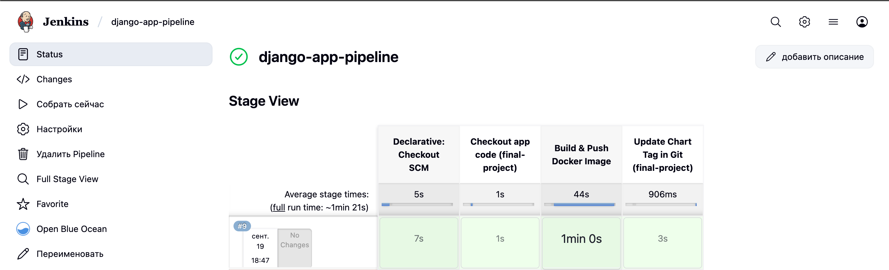
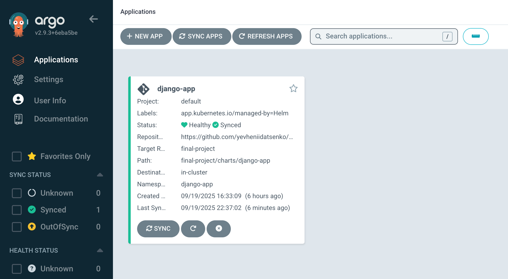
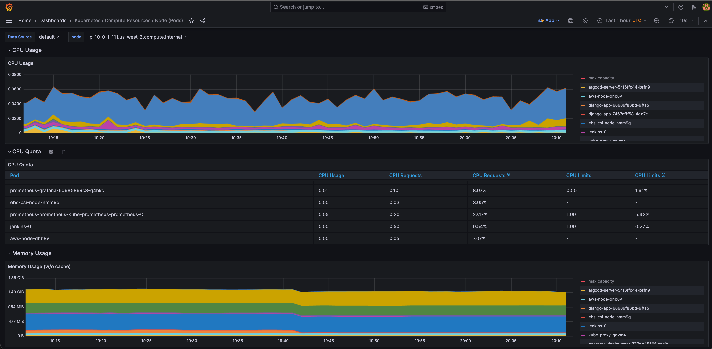

# Final DevOps Project: AWS Infrastructure Automation with Terraform

## Overview

This project deploys a full-featured, production-ready infrastructure on AWS using Terraform and Kubernetes. It includes secure networking, scalable application deployment, CI/CD automation, and monitoring and alerting. The architecture leverages:

- VPC for secure and isolated networking  
- EKS for Kubernetes orchestration  
- RDS (PostgreSQL and Aurora) for managed database services  
- ECR for container registry  
- Jenkins and Argo CD for CI/CD pipelines and GitOps deployment  
- Prometheus and Grafana for monitoring and visualization

## Technical Requirements

- AWS Infrastructure built with Terraform  
- Kubernetes cluster management via EKS  
- Application deployment with Helm charts  
- CI/CD integration (Jenkins and Argo CD)  
- Monitoring stack with Prometheus and Grafana  

## Step-by-Step Execution

### 1. Preparation

- Initialize Terraform configuration and backend:

```bash
terraform init
```

- Verify and set all environment variables and required input variables.

### 2. Infrastructure Deployment

- Launch infrastructure and Kubernetes resources:

```bash
terraform apply
```

- Confirm resource creation by inspecting namespaces:

```bash
kubectl get all -n jenkins
kubectl get all -n argocd
kubectl get all -n monitoring
```

### 3. Access Services

- Jenkins UI:

```bash
kubectl port-forward svc/jenkins 8080:8080 -n jenkins
```

- Argo CD UI:

```bash
kubectl port-forward svc/argocd-server 8081:443 -n argocd
```

### 4. Monitoring Setup

- Access Grafana Dashboard:

```bash
kubectl port-forward svc/grafana 3000:80 -n monitoring
```

- Review Prometheus metrics and visualize with Grafana.

### ⚠️ Important Notes

- Always destroy all resources after use to avoid unexpected charges:

```bash
terraform destroy
```

- Note that destroying infrastructure will also remove the Terraform state backend (S3 bucket and DynamoDB table).  
- Plan state backend recreation or local state usage accordingly.


## Project Structure

```
.
├── Jenkinsfile                  # Jenkins pipeline definition file for CI/CD
├── assets                      # Contains screenshots and visual assets for documentation
│   ├── SCR_1.png
│   ├── SCR_2.png
│   ├── SCR_3.png
│   └── SCR_4.png
├── backend.tf                  # Terraform backend configuration for remote state (S3 + DynamoDB)
├── charts                      # Helm charts for Kubernetes application deployment
│   └── django-app              # Sample Django application Helm chart
│       ├── Chart.yaml          # Helm chart metadata
│       ├── templates           # Kubernetes manifests templates (deployments, services, etc.)
│       └── values.yaml         # Helm values configuration
├── django-app                  # Django application source code and docker related files
│   ├── Dockerfile              # Docker image build instructions
│   ├── django_app              # Django app package
│   │   ├── asgi.py
│   │   ├── settings.py
│   │   ├── urls.py
│   │   └── wsgi.py
│   ├── docker-entrypoint.sh    # Entrypoint for Docker container
│   ├── manage.py               # Django management script
│   └── requirements.txt        # Python dependencies
├── django-app.yaml             # Kubernetes manifest for deploying Django app (alternative to Helm)
├── main.tf                    # Primary Terraform configuration file, invoking modules
├── modules                    # Terraform modules for reusable infrastructure components
│   ├── argo_cd                # Module to deploy Argo CD with Helm, includes app charts
│   │   ├── argo_cd.tf
│   │   ├── charts
│   │   ├── outputs.tf
│   │   ├── providers.tf
│   │   ├── values.yaml
│   │   └── variables.tf
│   ├── ecr                    # Module to manage ECR repositories
│   │   ├── ecr.tf
│   │   ├── outputs.tf
│   │   └── variables.tf
│   ├── eks                    # EKS cluster provisioning module
│   │   ├── aws_ebs_csi_driver.tf # EBS CSI driver installation
│   │   ├── eks.tf
│   │   ├── outputs.tf
│   │   └── variables.tf
│   ├── jenkins                # Jenkins deployment module including Helm chart values
│   │   ├── jenkins.tf
│   │   ├── outputs.tf
│   │   ├── providers.tf
│   │   ├── values.yaml
│   │   └── variables.tf
│   ├── monitoring             # Monitoring stack (Prometheus and Grafana) module
│   │   ├── monitoring.tf
│   │   ├── outputs.tf
│   │   ├── prometheus-values.yaml
│   │   ├── providers.tf
│   │   └── variables.tf
│   ├── rds                    # Module for RDS and Aurora cluster deployment
│   │   ├── aurora.tf
│   │   ├── outputs.tf
│   │   ├── rds.tf
│   │   ├── shared.tf
│   │   └── variables.tf
│   ├── s3-backend             # Module for creating S3 bucket and DynamoDB table for Terraform backend
│   │   ├── dynamodb.tf
│   │   ├── outputs.tf
│   │   ├── s3.tf
│   │   └── variables.tf
│   └── vpc                    # VPC and networking resources module
│       ├── outputs.tf
│       ├── routes.tf
│       ├── variables.tf
│       └── vpc.tf
├── outputs.tf                 # Terraform outputs across all modules
├── terraform.tfvars.example   # Sample variables input file for Terraform variables
└── variables.tf               # Terraform declared input variables
```

## Results



